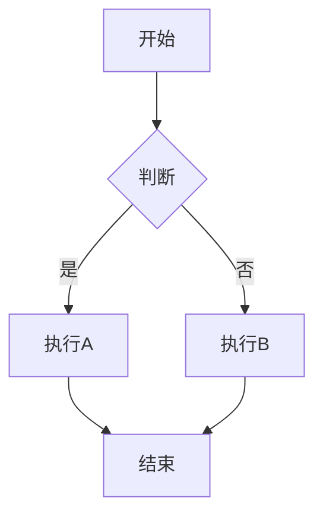
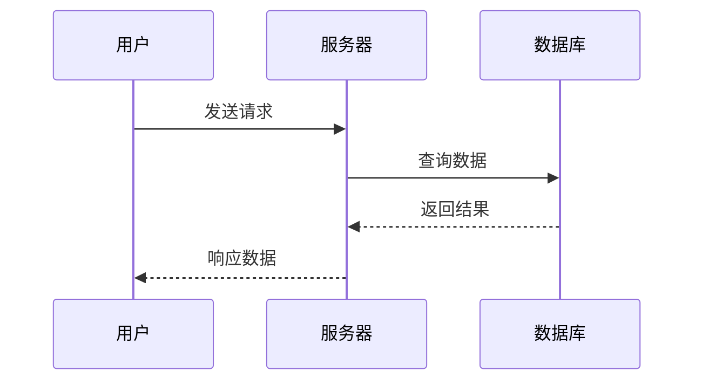
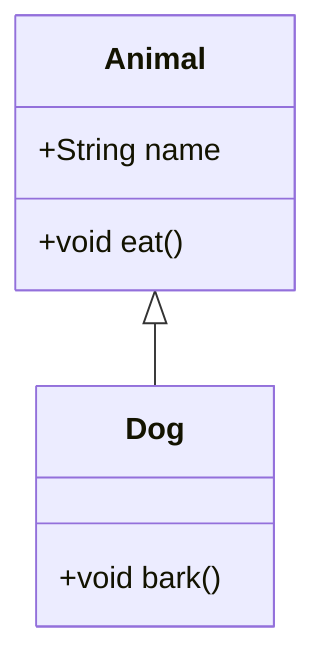
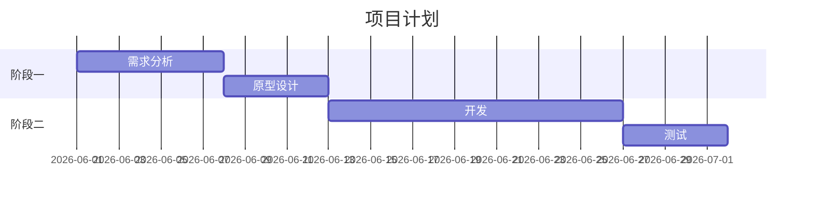
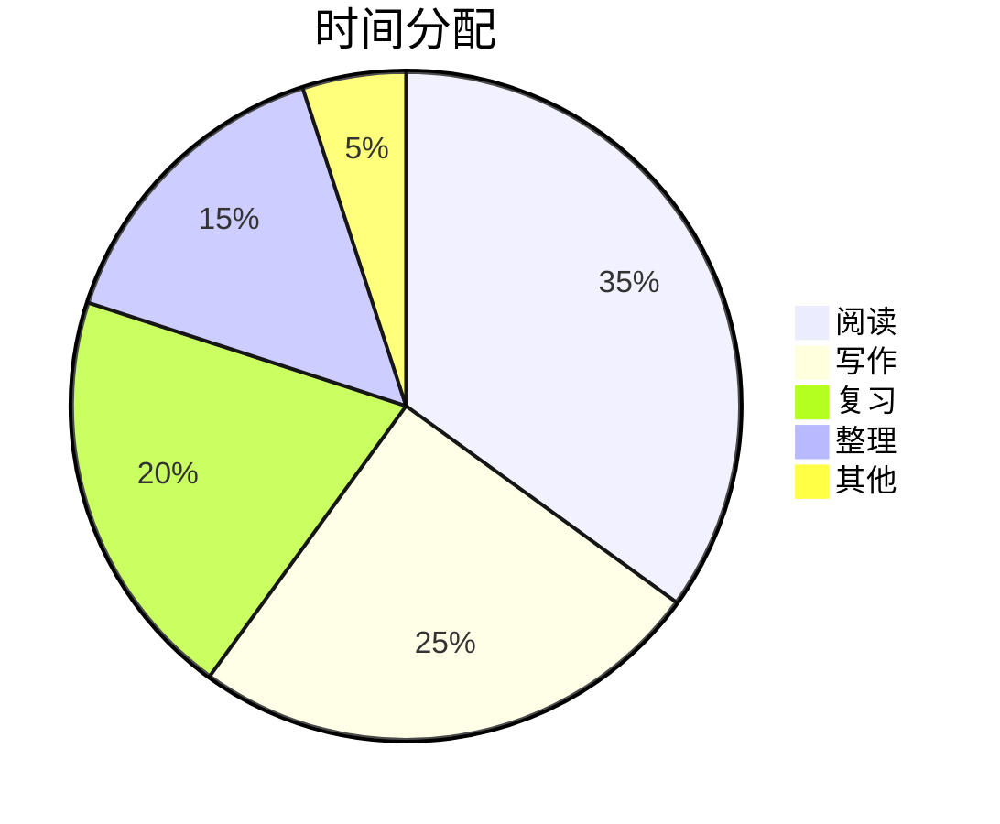

# Mermaid 图表

Obsidian 原生支持 Mermaid 图表，在代码块中指定 `mermaid` 即可渲染。

## 流程图

````

````

**方向**：`TD`(上下) / `LR`(左右) / `RL` / `BT`

**形状**：
```
A[矩形]      B(圆角)      C([椭圆])
D[[子程序]]   E[(数据库)]   F((圆形))
G{菱形判断}   H>标签]
```

## 时序图

````

````

## 类图

````

````

## 甘特图

````

````

## 饼图

````

````

---

## 相关
- [[Callout与排版]] — 配合 Callout 让笔记图文并茂
- [[Canvas白板]] — Canvas 中也可嵌入 Mermaid 图表
- [[Markdown语法速查]] — Markdown 基础语法，代码块是 Mermaid 的载体

← 回到 [[00-目录|目录]]
